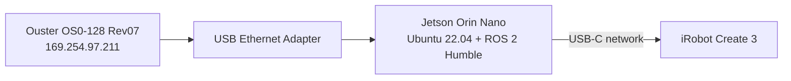

# Create 3 + Jetson Orin Nano + Ouster OS0 (ROS 2 Humble)

This repository tracks the **current, validated state** of a custom iRobot Create 3 platform with a Jetson Orin Nano and Ouster OS0-128 Rev07.

The repository name (`TurtleBot4Lite_OusterOS0`) and package name (`tb4_ouster_autonomy`) are retained for path compatibility only; they do **not** imply TurtleBot 4 software/hardware dependencies.

---

## Operation — Session A: Create a map by driving manually

Run these steps in order. You need three terminals on the Jetson.

**Step 1 — Undock the robot** (skip if already undocked)

```bash
source /opt/ros/humble/setup.bash
ros2 action send_goal /undock irobot_create_msgs/action/Undock "{}"
```

**Step 2 — Start the mapping stack** (Terminal 1)

Starts the Ouster driver, mount TF, point-cloud filter, SLAM Toolbox, and RViz.

```bash
source /opt/ros/humble/setup.bash
source /home/ivlaborin2/TurtleBot4Lite_OusterOS0/ros2_ws/install/setup.bash
ros2 launch tb4_ouster_autonomy robot.launch.py mode:=map rviz:=true
```

Wait until RViz opens and the laser scan ring is visible before driving.
Mapping mode uses SLAM Toolbox to create `map -> odom`; it does not use AMCL or
the **2D Pose Estimate** tool.

**Step 3 — Drive the robot** (Terminal 2)

```bash
source /opt/ros/humble/setup.bash
export ROS_DOMAIN_ID=42
ros2 run teleop_twist_keyboard teleop_twist_keyboard
```

Controls: `w`/`s` forward/back · `a`/`d` turn left/right · `Space` stop.
Drive slowly and make sure every part of the space is covered from multiple angles.
Watch the map grow in RViz (`/map` display, Fixed Frame: `map`).

**Step 4 — Save the map** (Terminal 3, when coverage looks complete)

```bash
source /opt/ros/humble/setup.bash
export ROS_DOMAIN_ID=42
ros2 run nav2_map_server map_saver_cli -f ~/TurtleBot4Lite_OusterOS0/arena_map
```

This writes `arena_map.pgm` and `arena_map.yaml` to the repo root.
Stop Terminal 1 and Terminal 2 with `Ctrl+C` after saving.

---

## Operation — Session B: Navigate autonomously with a saved map

Run these steps in order. You need one terminal on the Jetson.

**Step 1 — Undock the robot** (skip if already undocked)

```bash
source /opt/ros/humble/setup.bash
ros2 action send_goal /undock irobot_create_msgs/action/Undock "{}"
```

**Step 2 — Start the navigation stack** (Terminal 1)

Starts the Ouster driver, AMCL localisation, Nav2 (planner + controller + waypoint follower),
3D VoxelLayer costmap, bumper contact cloud, and RViz.

```bash
source /opt/ros/humble/setup.bash
source /home/ivlaborin2/TurtleBot4Lite_OusterOS0/ros2_ws/install/setup.bash
ros2 launch tb4_ouster_autonomy robot.launch.py mode:=navigate rviz:=true
```

To use a different map file: append `map:=/path/to/map.yaml`.

**Step 3 — Set the initial pose in RViz**

1. In RViz, click the **"2D Pose Estimate"** button in the toolbar.
2. Click on the map at the robot's current physical location and drag in the direction it is facing.
3. Watch the green AMCL particle cloud collapse around the robot — localisation is confirmed when the particles converge.

**Step 4 — Send navigation goals**

*Single goal:*
Click the **"Nav2 Goal"** button in the RViz toolbar, then click a destination on the map.
The robot plans a path (shown in blue), avoids obstacles in real time via the 3D costmap, and stops at the goal.

*Waypoint sequence (Nav2 Panel):*
Use the **Navigation 2** panel on the left side of RViz:
1. Click **"Waypoint / Nav Through Poses Mode"**.
2. Use the **"Nav2 Goal"** tool to click multiple waypoints on the map in order.
3. Click **"Start Nav Through Poses"** to execute the full sequence.

**Step 5 — Stop navigation**

Press `Ctrl+C` in Terminal 1. The robot stops immediately when the controller node shuts down.

---


## Current scope

Active, operational modes:

- **Map mode** — manual SLAM mapping via teleop + SLAM Toolbox
- **Navigate mode** — autonomous waypoint navigation with Nav2, AMCL localisation, 3D VoxelLayer costmap (Ouster OS0), and bumper contact cloud (LiDAR blind-spot coverage)
- **Diagnose mode** — read-only stationary diagnostics and TF inspection

Not yet validated:

- Long-duration unattended runs
- Multi-room or multi-floor navigation
- Sensor reconfiguration or firmware changes as part of routine operation

## System layout



## Current software behavior

```mermaid
flowchart LR
    SensorHTTP[Ouster HTTP GET] --> Diagnostics[stationary_diagnostics]
    ROSTopics[/odom /tf /dock_status /hazard_detection /ouster/*] --> Diagnostics
    MountTF[mount_tf.launch.py] --> TF[base_link -> os_sensor -> laser_frame]
    Diagnostics --> Report[JSON timing/rate report]
```

## Repository structure

```text
ros2_ws/src/tb4_ouster_autonomy/
├── config/
│   ├── nav2_params.yaml          # Nav2, AMCL, costmap (VoxelLayer + bumper source)
│   ├── slam_toolbox_params.yaml  # Async SLAM, 5 cm resolution
│   └── collision_monitor_params.yaml  # Retained, not launched
├── launch/
│   ├── robot.launch.py           # Entry point: mode:=map | navigate | diagnose
│   ├── mapping.launch.py         # Perception + SLAM Toolbox
│   ├── navigate.launch.py        # Perception + full Nav2 stack
│   ├── perception.launch.py      # Ouster driver + mount TF + cloud_filter + /scan relay
│   ├── mount_tf.launch.py        # Static TF: base_link → os_sensor → laser_frame
│   └── safety.launch.py          # Retained, not launched
├── rviz/
│   ├── view_robot.rviz           # Diagnose/map view (map frame is selected at launch)
│   └── navigate.rviz             # Navigate mode view (map frame, costmaps, paths)
├── tb4_ouster_autonomy/
│   ├── bumper_contact_cloud.py   # BUMP → PointCloud2 for costmap blind-spot coverage
│   ├── cloud_filter.py           # Removes self-hits, rate-limits /ouster/points
│   ├── stationary_diagnostics.py # Read-only topic timing diagnostics
│   ├── safety_authority_gate.py  # Retained, not launched
│   ├── overnight_monitor.py      # Retained, not launched
│   └── teleop_keyboard.py        # Retained, not launched
└── test/
```

Only `stationary_diagnostics.py` and `mount_tf.launch.py` are part of the current documented operational baseline.

## Build and local validation

```bash
source /opt/ros/humble/setup.bash
cd /home/runner/work/TurtleBot4Lite_OusterOS0/TurtleBot4Lite_OusterOS0/ros2_ws
colcon build --symlink-install
source install/local_setup.bash
PYTHONNOUSERSITE=1 colcon test --event-handlers console_direct+
colcon test-result --all --verbose
```

CI is defined in `/home/runner/work/TurtleBot4Lite_OusterOS0/TurtleBot4Lite_OusterOS0/.github/workflows/ci.yml` (lint, syntax checks, colcon build/test).

## Read-only hardware checks

Use these for current-state verification without changing robot/sensor behavior:

```bash
ip -brief addr
curl -fsS http://169.254.97.211/api/v1/sensor/config
ros2 topic list -t
ros2 run tb4_ouster_autonomy stationary_diagnostics --seconds 10
```

## Mount transform currently published

`mount_tf.launch.py` publishes:

- `base_link -> os_sensor`: `(x=0.005, y=-0.010, z=0.133)` m
- `os_sensor -> laser_frame`: `(x=0.0, y=0.0, z=0.038195)` m

These values are provisional mount measurements and should be treated as such until fully calibrated.

## Safety and change boundary

Unless explicitly requested, do **not**:

- publish `/cmd_vel`
- send motion/undock goals
- run autonomy launch paths as operational control
- write Ouster settings
- reinitialize sensor sessions
- flash firmware

Retired scripts and historical captures are archived outside this repository at:
`/home/ivlaborin2/tb4_archive_2026-09-17/`

## Useful references

- [Create 3 documentation](https://iroboteducation.github.io/create3_docs/)
- [Create 3 examples (Humble branch)](https://github.com/iRobotEducation/create3_examples/tree/humble)
- [Ouster ROS 2 driver guide (ros2 branch)](https://github.com/ouster-lidar/ouster-ros/tree/ros2)
- [ROS 2 Humble docs](https://docs.ros.org/en/humble/index.html)
- [ROS 2 workspace tutorial](https://docs.ros.org/en/humble/Tutorials/Beginner-Client-Libraries/Creating-A-Workspace/Creating-A-Workspace.html)
- [ROS 2 package tutorial](https://docs.ros.org/en/humble/Tutorials/Beginner-Client-Libraries/Creating-Your-First-ROS2-Package.html)
- [ROS 2 launch tutorial](https://docs.ros.org/en/humble/Tutorials/Intermediate/Launch/Launch-system.html)
- [Ouster coordinate frames](https://docs.ouster.com/sensor-docs/firmware/coordinate-system)
