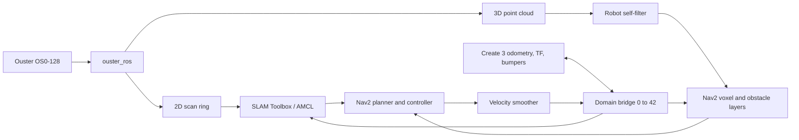

# Create 3 + Jetson Orin Nano + Ouster OS0

This repository contains the complete ROS 2 Humble workspace used to map an
indoor space and navigate an iRobot Create 3 fitted with a Jetson Orin Nano and
an Ouster OS0-128 Rev07.

The repository name (`TurtleBot4Lite_OusterOS0`) and ROS package name
(`tb4_ouster_autonomy`) are retained for compatibility. This is a custom
Create 3 platform and does not use TurtleBot 4 bringup.

## What the system does

- Creates a 2D occupancy map from an Ouster scan ring with SLAM Toolbox.
- Saves and reloads maps with the standard Nav2 map tools.
- Localizes on a saved map with AMCL.
- Plans paths and follows single goals or waypoint sequences with Nav2.
- Uses the full filtered Ouster point cloud in 3D local and global costmaps.
- Adds Create 3 bumper contacts to the local costmap to cover the LiDAR blind
  spot close to the robot.
- Bridges Create 3 topics on ROS domain 0 to the autonomy stack on domain 42.
- Provides a stationary diagnostics mode that does not command motion.



## Hardware and network

The working platform consists of:

- iRobot Create 3 mobile base
- Jetson Orin Nano running Ubuntu 22.04 and ROS 2 Humble
- Ouster OS0-128 Rev07 connected through a USB Ethernet adapter
- USB-C network connection between the Jetson and Create 3

The launch files use these network settings:

| Device or stack | Address/domain |
| --- | --- |
| Ouster sensor | `169.254.97.211` |
| Create 3 ROS graph | ROS domain `0` |
| Jetson autonomy graph | ROS domain `42` |

The unified launch file starts `domain_bridge` for mapping and navigation, so
the Create 3 can remain on domain 0 while the Jetson autonomy nodes use domain
42. Do not set `FASTRTPS_DEFAULT_PROFILES_FILE`; a Create 3-only discovery
profile can hide local Ouster and Nav2 nodes.

## Software setup

Install ROS 2 Humble and the runtime packages used by this workspace, including
the Ouster ROS 2 driver, Nav2, SLAM Toolbox, `domain_bridge`,
`teleop_twist_keyboard`, and `topic_tools`. Then install declared package
dependencies and build the overlay:

```bash
git clone YOUR_REPOSITORY_URL TurtleBot4Lite_OusterOS0
cd TurtleBot4Lite_OusterOS0
source /opt/ros/humble/setup.bash
rosdep install --from-paths ros2_ws/src --ignore-src --rosdistro humble -y \
  --skip-keys "ament_python domain_bridge"
cd ros2_ws
colcon build --symlink-install
source install/setup.bash
```

`ament_python` is supplied by the ROS installation rather than installed as a
rosdep key on the original Jetson. Install `ros-humble-domain-bridge` on a
fresh machine; the launch file can also use a bridge installed under
`ros2_ws/install/domain_bridge_vendor`.

Run the final `source` command from the repository root in every new terminal.

Before operating the robot, confirm the connections and ROS graph:

```bash
ip -brief addr
curl -fsS http://169.254.97.211/api/v1/sensor/config
ros2 topic list -t
```

The HTTP request is read-only. Starting the Ouster driver is different: it
applies the launch configuration and may reinitialize the sensor session.

## Stationary diagnostics

Diagnose mode publishes the configured mount transforms and runs the read-only
telemetry report. It does not start the sensor driver or publish velocity by
default:

```bash
source /opt/ros/humble/setup.bash
source ros2_ws/install/setup.bash
ros2 launch tb4_ouster_autonomy robot.launch.py mode:=diagnose
```

To inspect telemetry for a fixed interval without the unified launch file:

```bash
ros2 run tb4_ouster_autonomy stationary_diagnostics \
  --seconds 10 --topics /odom,/tf,/dock_status
```

Add `rviz:=true` to diagnose mode for a TF and sensor view. Add
`start_sensor:=true` only when intentionally starting the Ouster driver.

## Create a map

Mapping is a supervised manual-driving session. Use three terminals on the
Jetson and keep the robot in view.

### 1. Undock

Skip this step if the robot is already undocked:

```bash
source /opt/ros/humble/setup.bash
unset ROS_DOMAIN_ID
ros2 action send_goal /undock irobot_create_msgs/action/Undock "{}"
```

### 2. Start mapping

In terminal 1:

```bash
source /opt/ros/humble/setup.bash
source ros2_ws/install/setup.bash
ros2 launch tb4_ouster_autonomy robot.launch.py mode:=map rviz:=true
```

This starts the domain bridge, Ouster driver, mount transforms, point-cloud
filter, `/scan` relay, SLAM Toolbox, and RViz. Wait for the scan ring and map to
appear before driving.

### 3. Drive with the keyboard

In terminal 2:

```bash
source /opt/ros/humble/setup.bash
source ros2_ws/install/setup.bash
export ROS_DOMAIN_ID=42
ros2 run teleop_twist_keyboard teleop_twist_keyboard
```

Use `w`/`s` to move forward/backward, `a`/`d` to turn, and the space bar to
stop. Drive slowly, cover the usable area from several angles, and watch the
map fill in RViz. Teleoperation publishes directly to `/cmd_vel`, so the
operator is the safety authority during mapping.

### 4. Save the map

In terminal 3, after the map is complete:

```bash
source /opt/ros/humble/setup.bash
export ROS_DOMAIN_ID=42
ros2 run nav2_map_server map_saver_cli \
  -f "$(pwd)/arena_map"
```

This creates `arena_map.pgm` and `arena_map.yaml`. Stop the robot with the space
bar before ending the teleop and mapping processes with `Ctrl+C`.

## Navigate with a saved map

### 1. Undock and start Nav2

Undock as shown in the mapping procedure, then run:

```bash
source /opt/ros/humble/setup.bash
source ros2_ws/install/setup.bash
ros2 launch tb4_ouster_autonomy robot.launch.py mode:=navigate rviz:=true
```

The default map is the repository's `arena_map.yaml`. Select another map with:

```bash
ros2 launch tb4_ouster_autonomy robot.launch.py \
  mode:=navigate rviz:=true map:=/absolute/path/to/map.yaml
```

Navigation starts the perception pipeline, AMCL, Nav2 planner/controller,
velocity smoother, waypoint follower, bumper contact cloud, and RViz. Nav2 is
limited to 0.15 m/s linear and 0.50 rad/s angular speed by the supplied
configuration.

### 2. Localize the robot

In RViz, select **2D Pose Estimate**, click the robot's physical location on
the map, and drag the arrow in its facing direction. Wait for the AMCL particle
cloud to converge around the robot.

### 3. Send goals

- For one destination, select **Nav2 Goal** and click the destination and
  heading on the map.
- For a route, choose **Waypoint / Nav Through Poses Mode** in the Navigation 2
  panel, add goals in order, and select **Start Nav Through Poses**.

Keep the robot supervised and the area clear during operation. Cancel the
active Nav2 goal and confirm the robot is stationary before stopping the launch
process.

## Coordinate frames and sensor configuration

The Create 3 owns wheel control, odometry, and the `odom -> base_link` transform.
This package adds the sensor frames and never duplicates Create 3 odometry.

`mount_tf.launch.py` publishes:

- `base_link -> os_sensor`: `(x=0.005, y=-0.010, z=0.133)` m
- `os_sensor -> laser_frame`: `(x=0, y=0, z=0.038195)` m

The resulting optical origin is 0.171195 m above the floor. The transform uses
the measured 0.090 m plate-top height and assumes the plate logo is over the
Create 3 rotation center, the sensor is level, and its cable faces the rear.
Update the transform if the physical mount changes.

The perception launch configures the Ouster for `1024x10`, ROS time stamps, a
30 cm minimum distance, full point cloud and IMU output, and scan ring 63. It
publishes `/ouster/points`, `/ouster/cloud_filtered`, `/ouster/scan`, and the
standard `/scan` relay.

## Repository layout

```text
.
├── arena_map.pgm / arena_map.yaml       # Default saved map
└── ros2_ws/src/tb4_ouster_autonomy/
    ├── config/
    │   ├── create3_domain_bridge.yaml   # Domains 0 and 42 topic bridge
    │   ├── nav2_params.yaml             # AMCL, planning, control, costmaps
    │   └── slam_toolbox_params.yaml     # Mapping configuration
    ├── launch/
    │   ├── robot.launch.py              # Main diagnose/map/navigate entry point
    │   ├── perception.launch.py         # Ouster, TF, filtering, scan relay
    │   ├── mapping.launch.py            # Perception + SLAM Toolbox
    │   └── navigate.launch.py           # Perception + composed Nav2
    ├── rviz/                            # Mapping and navigation views
    ├── tb4_ouster_autonomy/
    │   ├── cloud_filter.py              # Self-filtered Ouster cloud
    │   ├── bumper_contact_cloud.py      # Bumper events for local costmap
    │   └── stationary_diagnostics.py    # Read-only health report
    └── test/                             # Unit tests
```

`safety.launch.py`, `safety_authority_gate.py`, `overnight_monitor.py`, and the
package-local `teleop_keyboard.py` are retained utilities but are not part of
the normal `robot.launch.py` mapping or navigation paths.

## Verify changes

After modifying the package, rebuild and run its tests:

```bash
source /opt/ros/humble/setup.bash
cd ros2_ws
colcon build --symlink-install
source install/setup.bash
PYTHONNOUSERSITE=1 colcon test --event-handlers console_direct+
colcon test-result --all --verbose
```

These commands verify the workspace and software tests. Hardware operation is
verified separately with the stationary checks or a supervised mapping or
navigation session.

## References

- [Create 3 documentation](https://iroboteducation.github.io/create3_docs/)
- [Create 3 examples, Humble branch](https://github.com/iRobotEducation/create3_examples/tree/humble)
- [Ouster ROS 2 driver](https://github.com/ouster-lidar/ouster-ros/tree/ros2)
- [ROS 2 Humble documentation](https://docs.ros.org/en/humble/index.html)
- [Navigation2 documentation](https://docs.nav2.org/)
- [SLAM Toolbox documentation](https://docs.ros.org/en/humble/p/slam_toolbox/)
- [Ouster coordinate frames](https://docs.ouster.com/sensor-docs/firmware/coordinate-system)
