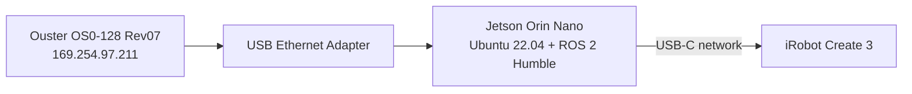
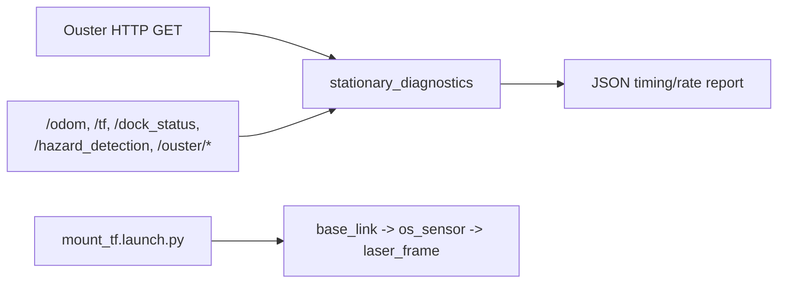

# Create 3 + Jetson Orin Nano + Ouster OS0 (ROS 2 Humble)

This repository tracks the **current, validated state** of a custom iRobot Create 3 platform with a Jetson Orin Nano and Ouster OS0-128 Rev07.

The repository name (`TurtleBot4Lite_OusterOS0`) and package name (`tb4_ouster_autonomy`) are retained for path compatibility only; they do **not** imply TurtleBot 4 software/hardware dependencies.

## Current scope

The active, supported scope is **read-only stationary diagnostics and frame setup**:

- ROS topic timing/rate diagnostics via `stationary_diagnostics`
- Ouster HTTP GET inspection (no sensor writes)
- Provisional static mount TF publication via `mount_tf.launch.py`
- Workspace build/test/lint support

Not in current validated scope:

- Autonomous navigation
- Motion execution
- Sensor reconfiguration or reinitialization as part of routine checks

## System layout



## Current software behavior



## Repository structure

```text
ros2_ws/src/tb4_ouster_autonomy/
├── config/
├── launch/
│   ├── mapping.launch.py
│   ├── mount_tf.launch.py
│   ├── perception.launch.py
│   ├── robot.launch.py
│   └── safety.launch.py
├── rviz/
├── tb4_ouster_autonomy/
│   ├── cloud_filter.py
│   ├── overnight_monitor.py
│   ├── safety_authority_gate.py
│   ├── stationary_diagnostics.py
│   └── teleop_keyboard.py
└── test/
```

Only `stationary_diagnostics.py` and `mount_tf.launch.py` are part of the current documented operational baseline.

## Build and local validation

```bash
source /opt/ros/humble/setup.bash
cd /home/runner/work/TurtleBot4Lite_OusterOS0/TurtleBot4Lite_OusterOS0/ros2_ws
colcon build --symlink-install
source install/local_setup.bash
PYTHONNOUSERSITE=1 colcon test --event-handlers console_direct+
colcon test-result --all --verbose
```

CI is defined in `/home/runner/work/TurtleBot4Lite_OusterOS0/TurtleBot4Lite_OusterOS0/.github/workflows/ci.yml` (lint, syntax checks, colcon build/test).

## Read-only hardware checks

Use these for current-state verification without changing robot/sensor behavior:

```bash
ip -brief addr
curl -fsS http://169.254.97.211/api/v1/sensor/config
ros2 topic list -t
ros2 run tb4_ouster_autonomy stationary_diagnostics --seconds 10
```

## Mount transform currently published

`mount_tf.launch.py` publishes:

- `base_link -> os_sensor`: `(x=0.005, y=-0.010, z=0.133)` m
- `os_sensor -> laser_frame`: `(x=0.0, y=0.0, z=0.038195)` m

These values are provisional mount measurements and should be treated as such until fully calibrated.

## Safety and change boundary

Unless explicitly requested, do **not**:

- publish `/cmd_vel`
- send motion/undock goals
- run autonomy launch paths as operational control
- write Ouster settings
- reinitialize sensor sessions
- flash firmware

Retired scripts and historical captures are archived outside this repository at:
`/home/ivlaborin2/tb4_archive_2026-09-17/`

## Useful references

- [Create 3 documentation](https://iroboteducation.github.io/create3_docs/)
- [Create 3 examples (Humble branch)](https://github.com/iRobotEducation/create3_examples/tree/humble)
- [Ouster ROS 2 driver guide (ros2 branch)](https://github.com/ouster-lidar/ouster-ros/tree/ros2)
- [ROS 2 Humble docs](https://docs.ros.org/en/humble/index.html)
- [ROS 2 workspace tutorial](https://docs.ros.org/en/humble/Tutorials/Beginner-Client-Libraries/Creating-A-Workspace/Creating-A-Workspace.html)
- [ROS 2 package tutorial](https://docs.ros.org/en/humble/Tutorials/Beginner-Client-Libraries/Creating-Your-First-ROS2-Package.html)
- [ROS 2 launch tutorial](https://docs.ros.org/en/humble/Tutorials/Intermediate/Launch/Launch-system.html)
- [Ouster coordinate frames](https://docs.ouster.com/sensor-docs/firmware/coordinate-system)
