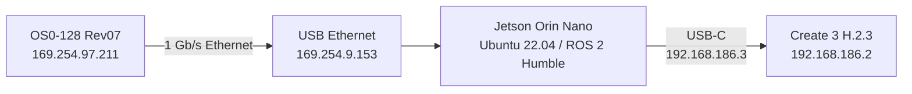

# iRobot Create 3 + Jetson Orin Nano + Ouster OS0

This repository is the ROS 2 Humble workspace and development plan for an **iRobot Create 3 robot with a custom Jetson Orin Nano and Ouster OS0-128 Rev07 payload**. The repository directory `TurtleBot4Lite_OusterOS0` and package `tb4_ouster_autonomy` are legacy names retained to keep existing paths and commands working. No TurtleBot 4 bringup, description, Raspberry Pi, camera, or stock lidar configuration is assumed. The current package provides stationary diagnostics and a provisional mount transform. It has no navigation, velocity publisher, or automatic startup. [TODO.md](TODO.md) is the plan for the remaining work.

## Official references and starting point

Use the [Create 3 documentation](https://iroboteducation.github.io/create3_docs/) for base hardware, networking, firmware and ROS interfaces, and the [Ouster ROS 2 driver guide](https://github.com/ouster-lidar/ouster-ros/tree/ros2) for sensor integration. For everything generic—packages, launch, parameters, QoS, TF, actions and rosbag—use the [standard ROS 2 Humble documentation](https://docs.ros.org/en/humble/index.html). Check package-specific behavior against the installed Humble version.

The [official Create 3 examples, Humble branch](https://github.com/iRobotEducation/create3_examples/tree/humble) provide useful patterns:

| Reference | Use in this project |
| --- | --- |
| [Lidar SLAM demo](https://github.com/iRobotEducation/create3_examples/tree/humble/create3_lidar_slam) | Follow the sensor/TF → SLAM Toolbox → RViz structure. Replace its RPLIDAR input with Ouster plus pointcloud_to_laserscan. Keep our measured mount transform; its RPLIDAR offsets and Raspberry Pi setup do not describe this payload. |
| [Teleoperation](https://github.com/iRobotEducation/create3_examples/tree/humble/create3_teleop) | Use standard `teleop_twist_keyboard` or `joy`/`teleop_twist_joy` later, remapped into the tested manual safety input with a deadman/timeout. Do not run the example's direct-to-base command unchanged. |
| [Coverage](https://github.com/iRobotEducation/create3_examples/tree/humble/create3_coverage) | Reference for action and hazard handling only; its non-systematic coverage behavior is not the mapping/navigation starting point. |

There is no need to clone or depend on the whole examples repository. Compose installed ROS packages and add only the payload filtering and safety policy that this robot needs. The first development target remains stationary TF, filtered cloud, `/scan`, RViz and recording; subsequent manual mapping uses SLAM Toolbox, then saved-map navigation uses AMCL and Nav2.

Create 3 already supplies [fused odometry](https://iroboteducation.github.io/create3_docs/api/odometry/) and base motion control. Consume its `/odom` and TF instead of adding an encoder controller or a second odometry estimator without measured need. `/stop_status.is_stopped` describes whether the base is stopped; it is not an e-stop latch acknowledgment.

The supplied [iRobot support article 10333](https://homesupport.irobot.com/s/article/10333) returned a loading/CSS error during review, so no hardware or API claims here rely on it. The ROS documentation pages challenged automated access; their official [Humble source](https://github.com/ros2/ros2_documentation/tree/humble/source) was used to verify package and launch conventions.

## Hardware and current connection



The USB Ethernet adapter is suitable: both Ethernet ends negotiated 1000 Mb/s full duplex and the Jetson interface reported zero RX errors or drops in the stationary check. The adapter's USB side negotiated 5 Gb/s. The Create 3 is reached through the Jetson USB device interface `usb1`; use ROS domain 0 and `rmw_fastrtps_cpp`. Leave `FASTRTPS_DEFAULT_PROFILES_FILE` unset. A prior USB-only Fast DDS profile hid local Ouster nodes and is retired.

The base was rebooted on 2026-09-17. Its H.2.3 Humble application used ROS domain 0, empty namespace, Fast DDS, and safety override `none`. After reboot, `/odom` and `/tf` arrived at about 20 Hz with stamp ages near 0.03 s. The Jetson serves Chrony on `192.168.186.0/24` for base clock alignment. The base's Wi-Fi client IP was unknown; USB remains the working link. No wheel command or undock was sent.

The sensor's last observed firmware was 3.2.0, serial `122313000402`, part `860-105000-07`. The active stream was `1024x20`, 30 cm minimum range, `RNG19_RFL8_SIG16_NIR16`, `ACCEL32_GYRO32_NMEA`, and UDP destination `169.254.9.153`. A fresh read-only query at 21:50 UTC on 2026-09-17 confirmed those values. The active UDP ports were `39152` and `35847` in that query; treat ports as session settings and use the live API rather than hardcoding them. Active settings differed from persisted settings earlier that day. Recheck both after a sensor power cycle:

```bash
curl -fsS http://169.254.97.211/api/v1/sensor/config
curl -fsS 'http://169.254.97.211/api/v1/sensor/config?source=persisted'
```

The persisted query on 2026-09-17 still showed `1024x10`, 50 cm minimum range, `LEGACY` IMU, `STRONGEST_TO_WEAKEST` return order, empty UDP destination, and `NORMAL` accel/gyro ranges. The working live ROS path does not require changing these now. If the owner wants the active scan choices to survive a sensor power cycle, they must review and save them on the sensor, then verify the persisted query.

The official Ouster ROS driver can select the receiving host when launched. A hand-maintained `metadata.json` is unnecessary for a live sensor. The old captured file was archived outside this repository; use the live HTTP API as the source of truth. The stationary sensor launch previously used here is shown below for reference. **It can configure/reinitialize the sensor and requires explicit authorization for a new sensor session; do not run it as a read-only status check.**

```bash
source /opt/ros/humble/setup.bash
export ROS_DOMAIN_ID=0 RMW_IMPLEMENTATION=rmw_fastrtps_cpp
unset FASTRTPS_DEFAULT_PROFILES_FILE
ros2 launch ouster_ros sensor.launch.xml sensor_hostname:=169.254.97.211 timestamp_mode:=TIME_FROM_ROS_TIME
```

**Starting this driver can reinitialize the sensor.** It has no base motion output. The earlier live stationary driver test on 2026-09-17 was authorized for that session. No new sensor configuration or firmware change is required for this connection. The installed driver is Ouster ROS 0.15.1. [Ouster ROS](https://github.com/ouster-lidar/ouster-ros) documents the live launch and optional metadata use.

## Read-only plan review — 2026-09-17, 21:55–21:56 UTC

The review reconfirmed OS0-128 Rev07 (`OS-0-128`, part `860-105000-07`, serial `122313000402`), firmware `3.2.0`, active `1024x20`, 30 cm minimum range and the addresses shown above. Active accel/gyro ranges remain `EXTENDED`; `NORMAL` is only a possible later owner-applied choice. The sensor API reports `TIME_FROM_INTERNAL_OSC`; `TIME_FROM_ROS_TIME` is a driver-side timestamp option, not evidence that the sensor clock is synchronized.

Commands used: `ip -brief addr`, HTTP GET of `/api/v1/sensor/config`, `/api/v1/sensor/config?source=persisted` and `/api/v1/sensor/metadata/sensor_info`, `ros2 topic list -t`, `ros2 topic info /cmd_vel -v`, and the installed diagnostic with `--seconds 10 --topics /odom,/tf,/dock_status,/ouster/points`.

| Observation | Result |
| --- | --- |
| Jetson interfaces | `usb1`: `192.168.186.3/24`; `enx0c379604b359`: `169.254.9.153/16` |
| `/odom` | 166 messages, 20.02 Hz, latest receive-time stamp age 0.028 s, frame `odom` |
| `/tf` | 166 messages, 20.02 Hz, age 0.030 s; `odom->base_link` and `odom->base_footprint` |
| `/dock_status` | 8 messages, 1.00 Hz; the diagnostic reports timing, not dock state |
| `/ouster/points` | 0 messages; no Ouster topics appeared in the initial topic listing |
| `/cmd_vel` | `geometry_msgs/msg/Twist`, 0 publishers, 1 subscriber (`motion_control`, best effort) |
| Installed packages | Ouster ROS 0.15.1; Nav2 collision monitor 1.1.20; SLAM Toolbox and pointcloud_to_laserscan available; default rosbag SQLite3 storage available |

No driver was started and no sensor settings or motion commands were sent. Sensor HTTP reachability does not establish a working ROS cloud stream. Diagnostic stamp ages describe reception of the last sample, not a continuous freshness watchdog; aggregate `/tf` results do not validate every transform. The package remains a stationary inspection tool.

The reviewed [development plan](TODO.md) is ready for stationary perception development and offline safety tests. Calibrated mounting, measured cloud throughput, blind-zone coverage and a tested stop path remain prerequisites for moving trials.

## Mount and frames

The top of the robot's plate is **0.090 m above the floor**. The iRobot logo marks the plate center. The OS0 sensor-bottom center is **0.005 m forward**, **0.010 m right**, and **0.043 m above** that plate. With Create 3 `base_link` at floor height and +X forward/+Y left, the provisional `base_link -> os_sensor` translation is **(0.005, -0.010, 0.133) m**. This assumes the logo is vertically above the Create 3 center of rotation, the sensor is level, and its cable points rearward. Confirm those three assumptions before treating the transform as calibrated.

The Ouster's optical plane is 0.038195 m above its sensor-bottom frame, so its nominal optical height is **0.171195 m above the floor**. The driver supplies its intrinsic `os_sensor -> os_lidar` transform; this workspace publishes only the base-to-sensor transform. The cloud frame observed in the live test was `os_lidar`. Ouster's lidar and sensor X axes differ, so view TF and the cloud together before interpreting directions. See [Ouster coordinate frames](https://docs.ouster.com/sensor-docs/firmware/coordinate-system).

The measured total robot height from the floor to the top of the OS0 lidar cap is **0.225 m (22.5 cm)**. Relative to the sensor optical plane (+0.1712 m), the physical top extends to **+0.0538 m**; the self-filter bounding box is set to `[-0.22, 0.22]` m in XY and `[-0.25, 0.06]` m in Z (`laser_frame`) to fully enclose the robot and sensor assembly. Nav2 obstacle layers and the collision monitor are tuned to an obstacle clearance envelope of **[0.04, 0.25] m** in `base_link`, providing a 2.5 cm safety margin above the lidar cap while permitting traversal beneath overhead clearances exceeding 25 cm.

The RViz screenshot's colored marks were point-cloud returns, not robot poses. The 2D Pose Estimate and Goal icons are generic RViz tools; no localization or goal-following stack was running.

## Stationary measurements and limits

An SDK sample saw 200 complete lidar frames over 10 s at 20 Hz with no missing lidar packets. A separate 100-frame sample had one missing IMU packet. Live `ouster_ros` published an organized 1024 × 128 cloud in `os_lidar` and IMU in `os_imu`. A focused ROS subscription received about **11–12 cloud messages/s** and **638 IMU messages/s**; cloud stamp age was about **0.067 s**. The lower observed cloud delivery rate needs investigation before mapping. The driver left the checked active sensor settings unchanged after initialization. Linux reported a 425,984-byte socket receive buffer instead of the requested 1,048,576 bytes; change the host limit only if continued measurements show packet loss.

The 30 cm sensor minimum range and the physical mounting leave a near-field blind zone. Self-returns, low obstacles, glass, and the full robot envelope still need validation. Keep Create 3 safety override `none`; the base limits forward speed to 0.306 m/s with its standard safety profile. The previously active `EXTENDED` accelerometer and gyro ranges were selected by Ouster CLI visualization; `NORMAL` is a reasonable later choice for precision if measurements show no saturation. The user will apply any desired persistent sensor settings after review.

## Workspace

This repository follows the [ROS 2 Humble workspace tutorial](https://docs.ros.org/en/humble/Tutorials/Beginner-Client-Libraries/Creating-A-Workspace/Creating-A-Workspace.html): `/opt/ros/humble` is the underlay and `ros2_ws` is the overlay. The source tree contains one `ament_python` package following the [official package tutorial](https://docs.ros.org/en/humble/Tutorials/Beginner-Client-Libraries/Creating-Your-First-ROS2-Package.html) and [launch installation tutorial](https://docs.ros.org/en/humble/Tutorials/Intermediate/Launch/Launch-system.html). Build artifacts are ignored by Git.

```text
ros2_ws/src/tb4_ouster_autonomy/
├── package.xml
├── setup.py
├── setup.cfg
├── resource/tb4_ouster_autonomy
├── config/
│   ├── collision_monitor_params.yaml
│   ├── nav2_params.yaml
│   └── slam_toolbox_params.yaml
├── launch/
│   ├── mount_tf.launch.py
│   ├── perception.launch.py
│   ├── safety.launch.py
│   ├── mapping.launch.py
│   └── robot.launch.py
├── rviz/
│   └── view_robot.rviz
├── tb4_ouster_autonomy/
│   ├── __init__.py
│   ├── cloud_filter.py
│   ├── overnight_monitor.py
│   ├── safety_authority_gate.py
│   └── stationary_diagnostics.py
└── test/
    ├── test_cloud_filter.py
    └── test_safety_authority_gate.py
```

### Building and Testing

In a fresh terminal with ROS 2 Humble sourced:

```bash
source /opt/ros/humble/setup.bash
cd /home/ivlaborin2/TurtleBot4Lite_OusterOS0/ros2_ws
colcon build --symlink-install
source install/local_setup.bash
PYTHONNOUSERSITE=1 colcon test --event-handlers console_direct+
colcon test-result --all --verbose
```

All 14 unit and integration tests execute and pass offline in an isolated ROS domain, validating deadman switch requirements, sensor timeout watchdogs, hazard detection latches, operator stops, non-holonomic velocity clamping, and point-cloud envelope filtering.

### CI/CD Pipeline

Continuous Integration is configured via GitHub Actions in [`.github/workflows/ci.yml`](.github/workflows/ci.yml). The pipeline automatically runs on every push and pull request to `main`:
1. **Linting & Syntax Validation:** Runs `flake8` under [`.flake8`](.flake8), validates XML manifests, compiles Python launch and node scripts, and validates YAML configuration syntax.
2. **Containerized Build & Test:** Executes inside official `ros:humble-ros-base-jammy`, installs dependencies via `rosdep`, builds with `colcon`, runs all 14 tests, and archives JUnit XML test results.

### Operating Entry Points

The unified launch entry point is `launch/robot.launch.py`:

```bash
# 1. Read-Only Stationary Diagnostics (safe for docked charging robot)
ros2 launch tb4_ouster_autonomy robot.launch.py mode:=diagnose rviz:=true

# 2. Manual SLAM Mapping (requires active deadman switch on /teleop/deadman)
ros2 launch tb4_ouster_autonomy robot.launch.py mode:=map rviz:=true

# 3. Supervised Goal Navigation
ros2 launch tb4_ouster_autonomy robot.launch.py mode:=navigate rviz:=true
```

### Safety Authority Architecture

All velocity commands are mediated by `tb4_ouster_autonomy/safety_authority_gate.py` and finalized through `nav2_collision_monitor`:
- Manual teleop commands are sent to `/teleop/cmd_vel` with a required deadman heartbeat on `/teleop/deadman`.
- Stale commands (>0.20 s), stale sensor telemetry (>0.25 s), or deadman heartbeat loss (>0.50 s) instantly zero the safe velocity output `/cmd_vel_safe`.
- Hardware bumper, cliff, or wheel-drop events on `/hazard_detection` trigger a latched emergency stop requiring physical clearance and an explicit `/safety/resume` service call.
- `nav2_collision_monitor` is the sole authorized writer to the base `/cmd_vel` topic, evaluating real-time proximity on `/ouster/cloud_filtered`.

Prior recordings and retired scripts are preserved at `/home/ivlaborin2/tb4_archive_2026-09-17/`, outside this working repository. Repeatable stationary baseline bags are stored locally in `bags/` (omitted from version control).
