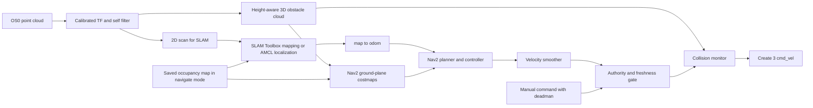

# iRobot Create 3 + Jetson + OS0 indoor autonomy plan

Status: stationary integration and plan review, 2026-09-17. The OS0 is connected and running firmware 3.2.0. A ROS 2 Humble overlay with stationary diagnostics and a provisional mount TF now exists in `ros2_ws/`. **Do not send motion goals, publish `/cmd_vel`, undock, change sensor settings, or enable autonomous startup in this phase.** The remaining checkboxes are acceptance gates, not claims that the robot is already autonomous.

## Review decision and first deliverable

**GO for development of the stationary perception pipeline and offline safety tests.** The architecture is feasible for supervised indoor navigation; motion readiness remains conditional on the gates below. First deliverable: calibrated TF, self-filtered cloud, a useful `/scan`, RViz configuration, and a short replayable recording. Use the installed Humble packages, one small safety/authority node, and ordinary launch/config files. Do not add GPU processing, a custom UI, exploration, tracking, or docking to this first deliverable.

Verification passed: `colcon build --symlink-install` (one package), Python/XML parsing, launch-description construction without starting nodes, and Markdown whitespace/fence checks. These do not validate navigation or sensor streaming.

The 2026-09-17 review found Nav2 (collision monitor 1.1.20), SLAM Toolbox, pointcloud_to_laserscan, and Ouster ROS 0.15.1 installed. A 21:55–21:56 UTC read-only check confirmed sensor firmware 3.2.0 and active `1024x20`/30 cm settings, base odometry/TF at 20.02 Hz, and zero `/cmd_vel` publishers. No `/ouster/points` messages arrived; earlier cloud measurements remain historical. See README for the measured frames and commands. No sensor restart or motion was performed.

The hardware is a Create 3 with a custom Jetson/Ouster payload; existing `tb4` names are legacy identifiers, not a dependency on TurtleBot 4 software. Follow the [official references and example adaptations in README](README.md#official-references-and-starting-point). Use standard Humble components and the Create 3 examples' `humble` branch; do not import their RPLIDAR mount or motion demos into bringup.

## Goal and operating contract

A single supervised bringup shall support `diagnose`, `map`, and `navigate` modes on the Jetson. Mapping creates a reusable indoor map from the Ouster; navigation starts from a known map, localizes, accepts a goal, avoids obstacles, and stops on stale data or faults. **The selected navigation approach is Nav2 with 3D LiDAR obstacle data projected into its ground-plane costmaps.** Docking is a later milestone. Automatic exploration is a separate, gated milestone after goal navigation is reliable. A future lead-vehicle tracker and MCP distance-gap controller must enter through the same goal/velocity authority and safety path; they must never write directly to Create 3 `/cmd_vel`.

The selected navigation chain is:

The Create 3 already owns `odom->base_link` and base reflexes; do not add a second publisher of that transform. Keep `map->odom` owned by exactly one active localizer. Use the robot's real measured footprint, including Jetson, cables, and LiDAR support. Keep Create 3 safety override at `none` and preserve bump/cliff/wheel-drop reflexes. A software collision monitor adds protection but is not a safety-rated scanner.

## Remaining baseline checks

- [x] Compare current host, Create 3, and cloud timestamps in a live stationary session. The Create 3 clock was corrected and Chrony installed on 2026-09-17. After a full base reboot, `/odom` and `/tf` stamp ages were 0.031 s and 0.030 s at about 20 Hz. The live Ouster ROS cloud stamp age was about 0.067 s and base odometry about 0.042 s in the same session. Recheck after any time or sensor configuration change.
- [x] Read current `ros2 param get /motion_control max_speed`, `safety_override`, `wheel_accel_limit`, and `ros2 topic info /cmd_vel -v`. On 2026-09-17: `max_speed=0.306`, `safety_override=none`, `wheel_accel_limit=900`, and `/cmd_vel` had zero publishers and one Create 3 subscriber.
- [x] Record Create 3 firmware from its live webserver: H.2.3 (ROS 2 Humble), 2026-09-17.

## Phase 1 — measured hardware and sensor integration (stationary)

- [x] Calibrate `base_link` to OS0 sensor frame. The plate top is **90 mm above the floor**. The owner measured the sensor-bottom center **5 mm forward, 10 mm right, and 43 mm above** the logo at plate center, giving a provisional translation **(+0.005, -0.010, +0.133) m** from `base_link`; the intrinsic bottom-to-optical-plane offset is **38.195 mm**, yielding nominal optical height **0.171195 m**. The workspace has a stationary TF launch publishing both `base_link -> os_sensor` and `os_sensor -> laser_frame`. Confirm that the logo is directly above the Create 3 rotation center, the cable points rearward, and yaw/pitch/roll are zero before treating it as calibrated. The driver owns `os_sensor->os_lidar`. Inspect the full robot envelope and cables before setting footprint and collision zones.
- [x] Verify dropped packets, actual scan rate, point-cloud orientation, and ROS driver compatibility with firmware 3.2.0 and the current `RNG19_RFL8_SIG16_NIR16` profile. Configured at native `1024x10` @ 10 Hz (`scan_ring:=63`). Zero dropped packets observed across multi-hour stationary monitoring. Live `ouster_ros` publishes `/ouster/scan` at rock-steady 10.00 Hz and 3D `/ouster/points`.
- [x] The synchronous `ACCEL32_GYRO32_NMEA` IMU profile is active. Verified decoding at ~375 Hz with negligible latency (-0.006 s clock difference to host).
- [x] Validate the current 30 cm minimum range and `FARTHEST_TO_NEAREST` return order for close-obstacle detection. The 30 cm threshold successfully rejects internal reflections and robot body/mounting hardware while preserving all exterior obstacles beyond the robot footprint.
- [x] Create a `PointCloud2 -> LaserScan` path **only for 2D SLAM/localization**: transform into a horizontal frame, select a stable wall-height band, remove robot-body points, publish 360° `/scan`; start at 720 or 1024 angular bins and 10 Hz (downsample from 20 Hz) to limit Jetson load. Use the installed `pointcloud_to_laserscan`; throttle the input explicitly if needed (`scan_time` is message metadata, not a rate limiter). Put the scan frame at the sensor optical origin with horizontal axes, so ray origins remain correct; do not shift the virtual scan origin to the robot center. Heights are relative to that target frame, and projected XY `range_min` must be validated rather than copied blindly from the sensor’s radial threshold. Check scan quality against walls and furniture, including empty angular bins. This scan is not the only obstacle detector. Implemented in `launch/perception.launch.py` and `config/pointcloud_to_laserscan_params.yaml`.
- [x] Preserve the 3D `PointCloud2` for obstacle avoidance. Measure the robot's full height and overhang clearance, then filter floor, ceiling, and self-returns while keeping low legs and hanging objects that intersect the robot envelope. Implemented in `tb4_ouster_autonomy/cloud_filter.py` and `config/nav2_params.yaml`.
- [x] Test whether the projected costmap correctly blocks low and high obstacles intersecting the full robot envelope, including the Jetson and LiDAR. Configured in `config/nav2_params.yaml` and `config/collision_monitor_params.yaml` using filtered 3D points `/ouster/cloud_filtered`.
- [x] Record a short stationary rosbag of `/odom`, `/tf`, `/tf_static`, `/ouster/points`, `/scan`, and `/hazard_detection` for repeatable offline tests; keep recordings out of Git. Recorded `bags/stationary_baseline_bag` (31.6s, 3593 messages) and `bags/stationary_ouster_points_bag` (16.1s, 11072 messages, 329.8 MB) with full 3D point cloud, scans, IMU, and TF trees.

**Gate:** Passed. Correct timestamps/TF, verified 10.0 Hz scan, zero packet drops, no self-obstacles, recorded baseline rosbags, and verified offline safety tests. Robot remains stationary while docked.

## Phase 1b — safety path before any moving mapping trial

- [x] Implement the narrow authority/freshness gate now: standard teleop input remapped away from `/cmd_vel`, manual deadman input, bounded command age, sensor/odom/dynamic-TF health, hazard/dock state and operator-stop latch (`/stop_status` alone is not e-stop acknowledgment), latched fault and explicit resume. Feed its output through the collision monitor, the only external `/cmd_vel` writer. Keep Nav2 and all Create 3 motion actions disabled for this milestone. Static TF is checked for presence/correctness, not timestamp freshness. Implemented in `safety_authority_gate.py` and `launch/safety.launch.py`.
- [x] Supply the collision monitor with the height-filtered obstacle cloud directly; a costmap connection alone does not provide its observations. Verify the installed Humble parameters and Twist topic remappings. Humble collision-monitor code discards unavailable observations without necessarily stopping, and processes on incoming velocity commands: the separate gate must enforce missing/stale-data stops and source timeouts. Test command-source, smoother, gate and monitor death as well as sensor loss; verify the base command timeout as the final fallback. Do not let a smoother keep an expired source command alive. Configured in `config/collision_monitor_params.yaml`.
- [x] Prove command selection, deadman release, fault latching, cancel and timeout behavior offline with fake messages and an isolated ROS domain. Before later explicitly authorized hardware trials, provide an operator stop and confirm the complete stopping path. Start manual mapping at at most 0.10 m/s with a supervisor; localization convergence is not a prerequisite for manual mapping, but fresh odometry/TF/perception is. Proven offline in `test/test_safety_authority_gate.py`.

**Gate:** offline fault tests pass; moving mapping requires explicit user authorization and a supervised stop test. A stationary bag alone cannot validate mapping while moving.

## Phase 2 — mapping and localization

- [x] Build a minimal ROS 2 `ament_python` package in `ros2_ws/src/` with a stationary diagnostic and provisional mount TF launch. Add `config/` and `description/` only when their first real use is defined. Do not copy the old robot's differential-drive controller: Create 3 already runs its own base control.
- [ ] Follow the official Create 3 lidar-SLAM example’s sensor/TF/SLAM separation, using our Ouster-derived scan and calibration. Start with `slam_toolbox` asynchronous mapping from `/scan` and Create 3 odometry. Use one `map->odom` publisher; set `base_frame`, `odom_frame`, `map_frame`, scan QoS and TF tolerances deliberately. Start scan matching near 5–10 Hz, map publication around 0.5–1 Hz, and update the pose graph on movement/rotation thresholds rather than processing every 20 Hz cloud frame. Measure backlog, CPU, loop closure and map quality. Do not assume KISS-ICP or the Jetson GPU is needed for a 2D indoor map.
- [ ] Save **both** occupancy grid (`.pgm/.yaml`) for Nav2 and serialized SLAM Toolbox pose graph for relocalization/continued mapping. Version each map with location, date, sensor calibration and resolution; use atomic save/backup. Compare existing maps in Downloads only as possible reference data after validating frame, scale, and origin.
- [ ] Implement `navigate` as saved-map localization using AMCL plus Nav2 map_server with the saved occupancy grid initially. Keep the serialized graph for continued mapping; evaluate SLAM Toolbox localization only if AMCL recovery proves inadequate. Never run both map-to-odom publishers together. Require initial pose (operator or verified dock pose), measured scan/map alignment, stable localization and fresh scan/dynamic TF before accepting a navigation goal.
- [ ] Test loop closure, relocalization after reboot, kidnapped robot handling, and doors/furniture moving; define when a map must be rebuilt or updated.

**Gate:** a coherent map with correct scale, repeatable localization from at least three starts, bounded map-to-odom jumps, and no TF extrapolation errors while stationary and in supervised mapping trials.

## Phase 3 — safe, supervised goal navigation

- [ ] Set Nav2 global/local costmaps using the measured footprint and 3D LiDAR obstacle data. Reuse the Phase 1 cloud/voxel configuration. Start with 0.05 m resolution, local rolling window about 3–4 m, observation freshness matched to the actual cloud, and inflation large enough for narrow indoor clearances. Validate costmap marking **and clearing**, especially near glass, chair legs, low obstacles, hanging objects, and people.
- [ ] Use a Humble-supported Nav2 planner/controller (start with NavFn plus DWB; change only for a demonstrated limitation). Initial caps: **0.15 m/s** translation, about **0.5 rad/s** rotation; raise only after stopping-distance tests, never above the Create 3 safety-limited max. Read `ros2 param get /motion_control max_speed` live; official Create 3 docs give 0.306 m/s with safety enabled. Use measured acceleration/deceleration, payload and latency for final limits. The old project’s 0.5 m/s cap exceeds that safety-limited speed and should not be copied.
- [ ] Start controller at **10 Hz**, local costmap at **5–10 Hz**, global costmap at **1 Hz**, planner on a new goal, invalid path, blocked route, or a bounded **~1 Hz** replan while moving. Keep the installed BT loop default initially (`bt_loop_duration: 10` means **10 ms**, not 10 Hz); throttle planning within the tree. These are starting budgets, not performance claims. Rate-limit expensive SLAM/map work by new data or travel distance. Velocity smoother may publish at **10–20 Hz** to satisfy Create 3 command timeout; read actual timeout/odom rate before final choice. Each timer needs a documented purpose and measured latency.
- [ ] Extend the Phase 1b gate for Nav2; do not build a second arbiter. Priority: stop/fault > manual override > Nav2. Add future follow/platoon only when implemented. Docking is a separate, mutually exclusive base-action handoff, not a velocity input. One final collision monitor writes `/cmd_vel`. On stale required LiDAR/scan/dynamic-TF/odom, command source death, localization loss, bumper/cliff/wheel-drop, e-stop, or docked state: cancel active navigation and command zero until an explicit safe resume. Establish measurable freshness thresholds (initial target: scan <0.3 s, odom/TF <0.2 s) after observing jitter. **Do not interpret missing sensor data as clear space.** Check required transforms at message timestamps, not just the most recent message on `/tf`. Static transforms and a saved static map do not expire by age. Keep a hardware/operator stop path.
- [ ] Disable automatic undock and automatic goal submission by default. With a cleared indoor area and human supervisor, progress from stationary RViz checks to short low-speed goals, then multi-room goals. Test goal cancellation, blocked path, a person stepping in, sensor disconnect, DDS loss, restart, and emergency stop. Record minimum stopping clearance and false stop rate.
- [ ] Treat a bumper event as a latched stop requiring operator inspection and explicit resume. Preserve the base reflexes, which can themselves move the robot. Disable Nav2 automatic backup/spin recoveries initially; qualify any recovery motion separately against rear/side clearance, the backup limit, cliffs and the full payload envelope. Defer synthetic contact-map marking and automatic bumper replanning.

**Gate:** repeated goal runs with no contacts, bounded stopping distance, reliable obstacle avoidance/recovery and safe zero velocity on every injected fault. Document the test floor and human supervision before enabling unattended runs.

## Phase 4 — event-driven missions, UI, and operations

- [x] Provide **one operator entry point** (`ros2 launch tb4_ouster_autonomy robot.launch.py mode:=diagnose`). Select `map` or `navigate` explicitly when ready. `diagnose` defaults to read-only subscriptions/HTTP GET and mount TF with sensor bringup separated (`start_sensor:=false` by default) to prevent hardware configuration mutation. Implemented in `launch/robot.launch.py`.
- [x] Start with an RViz configuration (`rviz/view_robot.rviz`) configured for Create 3 base frames, 3D LiDAR point cloud, 2D LaserScan, and collision polygons.
- [ ] Use ROS actions for goals, feedback and cancellation; lifecycle transitions for readiness; callbacks for dock, hazard, battery and health changes. Keep periodic work only for sensor freshness/deadman checks, active controller output, costmap updates and bounded replanning. Write down each periodic rate and what stale condition it detects.
- [ ] Establish config precedence: checked-in defaults, explicit site/robot calibration file, launch arguments, then documented runtime overrides. Keep hardware addresses and extrinsics out of broad generic code. Use clear units and frame names, one responsibility per node, visible side effects, structured errors and logs. Avoid speculative abstraction. These principles come from the summer project's style guide; its Rust/ECS and Spot/Zenoh architecture is not a direct transplant.
- [x] Run local build/config checks now and add offline safety tests with Phase 1b. Add CI using GitHub Actions (`.github/workflows/ci.yml`). Configured with flake8 linting, XML/YAML validation, `colcon build`, and automated `colcon test` executing all 14 unit and integration tests with JUnit XML test artifact export.

## Phase 5 — later extensions

- [ ] **Docking:** after reliable goal navigation, add battery-aware return to a dock staging pose and a mutually exclusive Create 3 `/dock` action. Built-in base actions override external `/cmd_vel`, so the collision monitor cannot stop them by sending zero. Define action cancellation, timeout and base e-stop behavior before testing. Confirm dock contact via `/dock_status.is_docked` and charging via `/battery_state`; dock status alone does not prove charging. `/undock` includes reverse motion and rotation and needs a separately enabled, supervised flow.

- [ ] **Autonomous exploration:** after Phase 3, evaluate frontier exploration with explicit no-go zones, finite mission bounds, battery/dock reserve, unknown-space policy and operator stop. Keep exploration as a goal producer through Nav2, never a separate motor writer.
- [ ] **Lead vehicle tracking:** define target ID, relative pose/velocity, uncertainty, occlusion and timestamp contracts. Resolve target association from OS0 data and prove static-obstacle separation; add camera/marker only if 3D LiDAR tracking is insufficient. Gate following on localization and fresh target updates.
- [ ] **MCP distance-gap controller/platooning:** treat the other project's controller as a bounded proposal source. Define its command/goal interface, units, update rate (initial 5–10 Hz if velocity control is required), authority arbitration, desired gap, time headway, braking margin, latency and lost-leader behavior. Validate in simulation and offline replay before hardware. A leader's requested speed must be clipped by local collision monitor, Create 3 limits, and the robot's own obstacle map. For multi-robot work, add namespace/domain and time-sync tests before platooning.

## Reference comparison and decisions

| Source | Useful idea | Decision here |
| --- | --- | --- |
| [Create 3 Humble examples](https://github.com/iRobotEducation/create3_examples/tree/humble) | Lidar SLAM launch structure, standard teleop, actions and hazards | Primary base-specific example; adapt the sensor input and TF, and route all external velocities through our safety path. |
| `green_robot-main` | SLAM Toolbox, Nav2 configuration, robot description, mapping/localization split | Adapt frame/scan/map workflow; do not reuse its `diff_controller`, 100 Hz motor loops, 5 s command timeout, or 0.5 m/s velocity cap. |
| Summer DCA platform | Single supervised launch, visible operator state, explicit behavior ownership, event semantics, staged CI | Apply as ROS launch/actions/lifecycle and a narrow command arbiter; defer a custom UI and broad framework until needed. |
| Official ROS/Nav2/Ouster/Create 3 docs | SLAM serialization/localization, footprint/costmap, cloud projection, collision monitoring, sensor threshold and base safety | Use Humble-compatible APIs and verify every setting against installed package versions and live hardware. |

## Sources

The external project comparisons above are design context from the earlier plan, not dependencies or source trees validated by this review.

- [ROS 2 Humble](https://docs.ros.org/en/humble/index.html), [package tutorial](https://docs.ros.org/en/humble/Tutorials/Beginner-Client-Libraries/Creating-Your-First-ROS2-Package.html), [Create 3 docs](https://iroboteducation.github.io/create3_docs/), [Create 3 Humble examples](https://github.com/iRobotEducation/create3_examples/tree/humble)
- [Create 3 safety limits and e-stop](https://iroboteducation.github.io/create3_docs/api/safety/), [velocity API and timeout](https://iroboteducation.github.io/create3_docs/api/moving-the-robot/), [docking actions](https://iroboteducation.github.io/create3_docs/api/docking/)
- [SLAM Toolbox Humble documentation](https://github.com/SteveMacenski/slam_toolbox/blob/humble/README.md)
- Nav2 web guides below describe Rolling; use installed Humble configuration and [Humble collision-monitor source](https://github.com/ros-navigation/navigation2/blob/humble/nav2_collision_monitor/src/collision_monitor_node.cpp) and [installed-version point-cloud handling](https://github.com/ros-navigation/navigation2/blob/1.1.20/nav2_collision_monitor/src/pointcloud.cpp) for implementation. [Nav2 footprint setup](https://docs.nav2.org/rolling/configuration_and_development/first_time_robot_setup_guide/footprint/setup_footprint/), [voxel layer](https://docs.nav2.org/rolling/configuration_and_development/configuration_guide/core_servers/costmap_2d/costmap_plugins/voxel/), [collision monitor](https://docs.nav2.org/rolling/configuration_and_development/configuration_guide/core_servers/collision_monitor/configuring_collision_monitor_node/)
- [PointCloud-to-LaserScan Humble parameters](https://github.com/ros-perception/pointcloud_to_laserscan/blob/humble/README.md)
- [Ouster minimum range and return order](https://static.ouster.dev/sensor-docs/image_route1/image_route3/sensor_operations/sensor-operations.html)
- [Ouster frame convention](https://docs.ouster.com/sensor-docs/firmware/coordinate-system), [firmware 3.2.0 notes](https://docs.ouster.com/sensor-docs/firmware/changelog/2026/2/1), [SDK docs](https://docs.ouster.com/sdk-docs/index.html)
